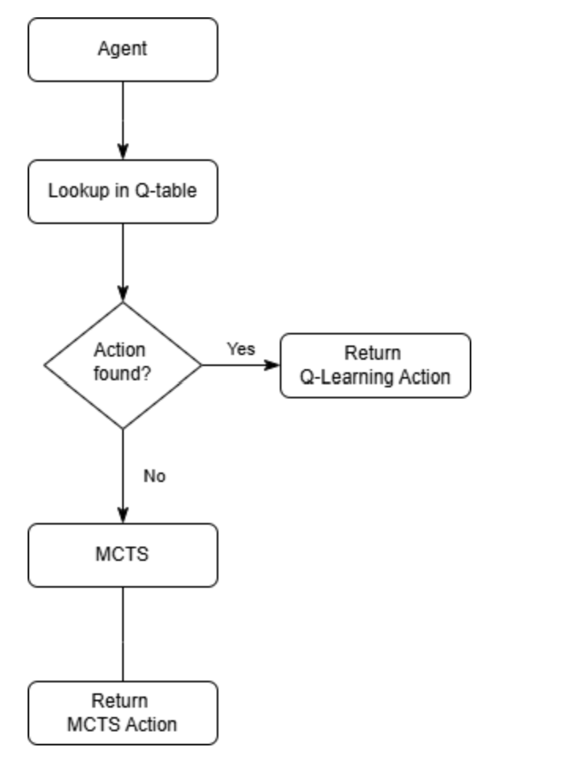

# Agent  2 – Q-Learning with MCTS

We name the second agent as **Q-Learning with MCTS**, which is an innovative system combining Q-Learning and MCTS (Monte Carlo Tree Search). At runtime the agent first looks up its compact Q-table; if the abstracted state has a stored best action, it executes that in microseconds. Otherwise it invokes MCTS to deeply simulate and select a move. This hybrid design delivers ultra-fast responses in familiar positions and robust search in novel ones.

# Table of Contents

  * [Design Motivation](#design-motivation)
  * [Solved challenges](#solved-challenges)

### Design Motivation  

During the preliminary stage, we explored the use of different AI techniques to implement a Sequence Agent, including traditional Q-Learning, MCTS, and many other algorithms. The main bottleneck we encountered was the dual challenge of computational power limitation and time constraints.

- **Initial Attempts and Discovered Problems**

  Initially, we attempted online Q-table training during the 15-second warm-up phase of the competition (14 seconds training + 1 second replay), but discovered two critical issues:

  - **Sparse Online Q-table Coverage**: 

    The short time resulted in only scattered state-action pairs being learned, with many mid-to-late game situations never visited, causing the agent to frequently fall back to simple rules and unable to leverage search advantages.

  - **Unstable Pure MCTS Decision Latency**: 

    Under the 1 second/step limit, pure MCTS requires extensive simulations in complex situations, leading to highly variable decision times that could approach or exceed timeout thresholds.

- **Hybrid Architecture Solution**

  Based on these findings, we proposed a hybrid architecture: moving all Q-learning training to an **offline environment**, utilizing 10-15 minutes for complete game simulations, enriching abstract features, and gradual ε-decay to generate high-quality Q-tables containing thousands of entries. During competition, the agent first performs **microsecond-level table lookup** (ε=0 greedy) to quickly execute actions for learned situations; only when truly encountering novel situations does it fall back to **MCTS** for precise search.

  This way, Q-learning's "foresight advantage" seamlessly combines with MCTS's "hindsight depth", ensuring ultra-low latency response for learned situations while providing powerful strategic depth when necessary.

- **Strategy Decomposition Framework**

  Given that Sequence is a stochastic, partial observability, asymmetric, zero-sum finite game, we categorized the original problem into four sub-problems based on two dimensions: full observability/partial observability information and adversarial/non-adversarial settings.

  Based on these four sub-problems, we developed targeted strategies:

  - **"Opponent's reward acquisition is predictable"**: Based on opponent's known resources, if they are in a position to gain reward → Q-Learning rapid table lookup response to prevent opponent scoring.
  - **"Agent's reward acquisition is predictable"**: Based on our own resources, if we are in a position to gain reward → Q-Learning instant lookup for optimal scoring path.
  - **"Opponent has high potential to gain reward"**: If opponent has 3-in-a-row or 4-in-a-row threats → MCTS deep analysis for best defensive strategy.
  - **"Other complex situations"**: Any novel situations not falling into above categories → MCTS exploration for locally optimal solutions.

- **Final Architecture Design**

Furthermore, since a standard action involves using one card and drawing one card, to reduce problem complexity, we regard drawing a card as playing this card at the position where it can achieve the highest score, and the score of the card-drawing behavior has been evaluated.

[Back to top](#table-of-contents)

### Solved Challenges

In this hybrid method combining Q-Learning with MCTS, I solved the following challenges:

1. Integrate two different AI paradigms seamlessly (as shown above).
2. Create comprehensive state abstraction for [Q-Learning](AI-Method-4.md)
3. Design effective heuristic evaluation for MCTS guidance  [Monte-Carlo-Tree-Search](AI-Method-3.md)
4. Implement opponent threat recognition and defensive strategies [Monte-Carlo-Tree-Search](AI-Method-3.md)
5. Optimize action selection through UCB1 with heuristic bias [Monte-Carlo-Tree-Search](AI-Method-3.md)
6. Handle memory constraints with compressed Q-table storage [Q-Learning](AI-Method-4.md)

* Note, here it is listed in code logics sequence. Detail of each one is listed in each page

[Back to top](#table-of-contents)